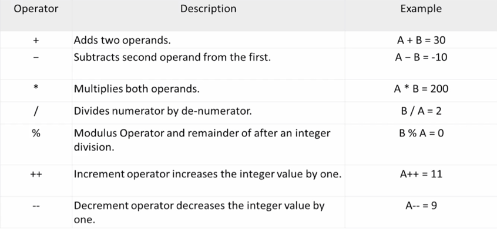
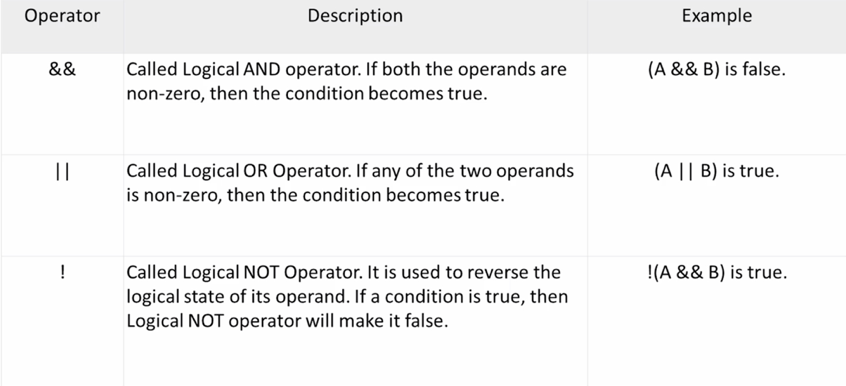
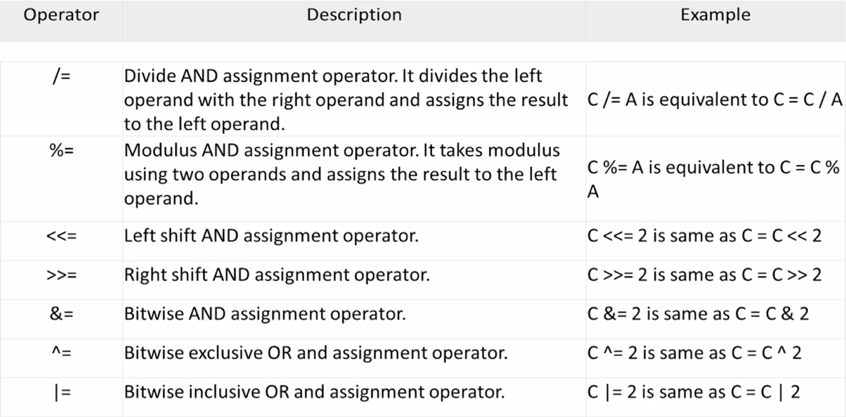
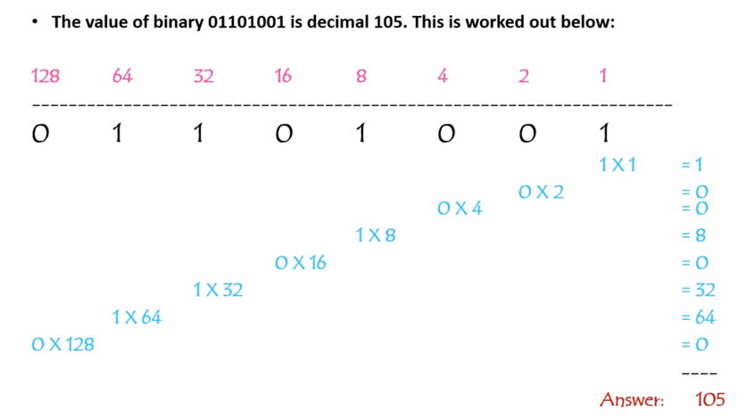
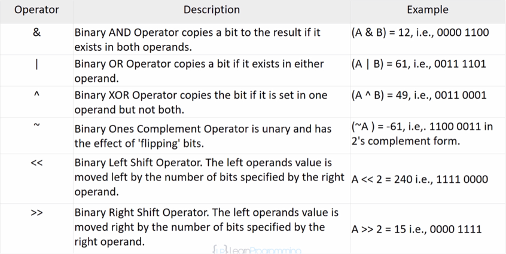
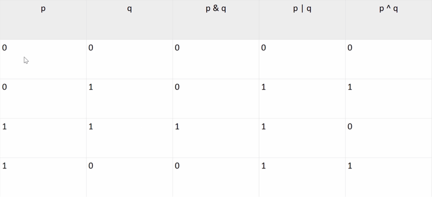

# Operators

Operators are functions that use a symbolic name, they perform mathematical or logical functions. Operators are predefined in C, just like they are in most other languages, and most operators tend to be combined with the **infix style**.

A *logical operator* (sometimes called a "Boolean operator") is an operator that returns a Boolean result that's based on the Boolean result of one or two other expressions. An *arithmetic operator* is a mathematical function that takes two operands and performs a calculation on them. Other operators include assignment, relational (<, >, !=), bitwise (<<, >>, ~).

## Expressions and Statements

### Expression

Statements form the basic program steps of C, and most statements are constructed from expressions. An expression consists of a combination of operators and operands. Operands are what an operator operates on. Operands can be constants, variables, or combinations of the two. Every expression has a value. There are some expressions: -6, 4+21, a*(b + c/d)/20, q = 5*2, x = ++q % 3, q > 3

### Statements

Statements are the building blocks of a program (declaration). A program is a series of statements with special syntax ending with a semicolon (simple statements). A statement is a complete instruction to the computer.

```c
int Jason; //Declaration statement
```

```c
Jason = 5; //Assignment Statement
```

```c
printf("Jason"); //Function call statement
```

```c
while (Jason < 20) Jason = Jason + 1; //Structure Statement
```

```c
return 0; //Return Statement
```

C considers any expression to be a statement if you append a semicolon (expression statements), so, 8; and 3-4; are perfectly valid in C.

#### Compound Statements

Two or more statements grouped together by enclosing them in braces (block).

```c
int index = 0;
while (index < 10)
{
printf("hello");
index = index + 1;
}
```

## Basic Operators

An **arithmetic** operator is a mathematical function that takes two operands and performs a calculation on them. A **logical** operator (sometimes called a "Boolean operator") is an operator that returns a Boolean result that's based on the Boolean result of one or two other expressions. **Assignment** operators set variables equal to values. It assigns the value of the expression at its
right to the variable at its left. A **relational** operator will compare variables against each other.

### Arithmetic Operators



```c
#include<stdio.h>

int main()
{
  int a = 33;
  int b = 15;
  
  printf("The result a is %d.\n", --a); //32
  printf("The result b is %d.\n", b++); //15
  printf("There are the new result of b %d.", b++); //16

  return 0;
}
```

### Logical Operators



### Assignment Operators




### Relational Operators


## Bitwise Operators

C offers bitwise logical operators and shift operators. They look something like the logical operators you saw earlier but are quite different and operate on the bits in integer values. They are not used in the common program.

One major use of the bitwise AND, &, and the bitwise OR, I, is in operations to test and set individual bits in an integer variable. They can use individual bits to store data that involve one of two choices. You could use a single integer variable to store several characteristics of a person:

* store whether the person is male or female with one bit
* use three other bits to specify whether the person can speak French, German, or Italian
* another bit to record whether the person's salary is $50,000 or more
* in just four bits you have a substantial set of data recorded

### Binary Numbers

A binary number is a number that includes only ones and zeroes. The number could be of any length. The following are all examples of binary numbers: 0, 10101, 1, 0101010, 10, 1011110101, 01, 0110101110, 111000, 000111

Every Binary number has a corresponding Decimal value (and vice versa), examples:

| Binary Numbercol | Decimal Equivalentcol |
| ---------------- | --------------------- |
| 1                | 1                     |
| 10               | 2                     |
| 11               | 3                     |
| ...              | ...                   |
| 1010111          | 87                    |

Each position for a binary number has a value. For each digit, multiply the digit by its position value, add up all of the products to get the final result. **In general, the "position values" in a binary number are the powers of two.** The first position value is 2^0, i.e. one. The 2nd position value is 2^1 , i.e. two. The 2nd position value is 2^2, i.e. four. The 2nd position value is 2^3 , i.e. eight. The 2nd position value is 2^4 , i.e. sixteen, etc.



**From right to left: 1+8+32+64 = 105;**

**from left to right: ((1+1\*2)\*2\*2+1)\*2\*2\*2+1 = 105**


**From right to left: 4+8+16+128 = 156;**

**from left to right: (((1\*2\*2\*2+1)\*2+1)\*2+1)\*2\*2 = 156**

### Bitwise Operators (tutorials point)



Truth Table



Type Conversions

conversion of data between different types can
happen automatically (implicit conversion) by the

language or explicit by the program

to effectively develop C programs, you must
understand the rules used for the implicit conversion

of floating-point and integer values in C

 Normally, you shouldn't mix types, but there
are occasions when it is useful

remember, c is flexible, gives you the
freedom, but, do not abuse it

 Whenever a floating-point value is assigned to
an integer variable in C, the decimal portion of the

number gets truncated

int x = 0:

float f=12.125;

x = 1; I/ value stored in x is the number
12, only the int portion is stored

assigning an integer variable to a floating
variable does not cause any change in the value of the

number

value is converted by the system and stored
in the floating variable

when performing integer arithmetic

if two operands in an expression are
integers then any decimal portion resulting from a division

operation is discarded, even if the result
is assigned to a floating variable

If one operand is an int and the other is a
float then the operation is performed as a floating

point operation

The Cast Operator

 As
mentioned, you should usually steer clear of automatic type conversions,
especially of demotions

better to do an explicit conversion

it is possible for you to demand the
precise type conversion that you want

called a cast and consists of preceding the
quantity with the name of the desired type in parentheses

parentheses and type name together
constitute a cast operator, i.e. (type)

 The
actual type desired, such as long, is substituted for the word type

The Cast Operator

 The
type cast operator has a higher precedence than all the arithmetic operators
except the unary

minus and unary plus

(int) 21.51 + (int) 26.99

is evaluated in C as

21 + 26

sizeof operator

 You
can find out how many bytes are occupied in memory by a given type by using the
sizeof operator

sizeof is a special keyword in C

sizeof is actually an operator, and not a
function

evaluated at compile time and not at runtime,
unless a variable-length array is used in its argument

 The
argument to the sizeof operator can be a variable, an array name, the name of a
basic data type,

the name of a derived data type, or an
expression

sizeof operator

sizeof(int) will result in the number of
bytes occupied by a variable of type int

 You
can also apply the sizeof operator to an expression

result is the size of the value that
results from evaluating the expression

 Use
the sizeof operator wherever possible to avoid having to calculate and
hard-code sizes into your

program

Other Operators

the asterisk "*" is an operator
that represents a pointer to a variable.

* 2;

?: is an operator used for comparisons

If Condition is true ? then value X :
otherwise value Y

name is the ternary operator

will discuss both of these operators when
we talk about pointers and decision statements

Overview

Operator precedence determines the grouping
of terms in an expression and decides how an

expression is evaluated

dictates the order of evaluation when two
operators share an operand

certain operators have higher precedence
than others

 for
example, the multiplication operator has a higher precedence than the addition
operator

x=7+3*2:

Can result in 13 or 20 depending on the
order of each operands evaluation

the order of executing the various
operations can make a difference, so C needs unambiguous rules

for choosing what to do first

In C, x is assigned 13, not 20 because
operator * has a higher precedence than +

first gets multiplied with 3*2 and then
adds into 7

 Each
operator is assigned a precedence level

multiplication and division have a higher
precedence than addition and subtraction, so they are

performed first

Whatever is enclosed in parentheses is
executed first, should just always use () to group expressions

Associativity

 What
if two operators have the same precedence?

Then associativity rules are applied

If they share an operand, they are executed
according to the order in which they occur in the

statement

For most operators, the order is from left
to right

1 == 2 = 3

operators == and != have same precedence

associativity of both == and != is left to
right

the expression on the left is executed
first and moves towards the right

the expression above is equivalent to

((1 ==2)!= 3)

(1 == 2) executes first resulting into 0
(false), then, (0 != 3) executes resulting into 1 (true)

Table (highest to lowest) (tutorials point)


•Operators are functions that use a symbolic name, they perform mathematical or logical functions.

•Operators are predefined in C, just like they are in most other
languages, and most operators tend to

be combined with the infix style

•A logical operator (sometimes called a

"Boolean operator") is an
operator that returns a Boolean

result that's based on the Boolean result
of one or two other expressions

•An arithmetic operator is a mathematical function that takes two
operands and performs a calculation

on them

• Other operators include assignment, relational (<, >, !=),
bitwise (<<, >>, ~)

Expressions and Statements

• Statements form the basic program steps of C, and most statements
are constructed from

expressions

• An expression consists of a combination of operators and operands

•operands are what an operator operates on

•operands can be constants, variables, or combinations of the two

•every expression has a value

-6

4+21

a*(b + c/d)/20

q = 5*2

X = ++9 % 3

9 > 3

• Statements are the building blocks of a program (declaration)

• A program is a series of statements with special syntax ending with
a semicolon (simple

statements)

•a complete instruction to the computer

•Declaration statement: int Jason;

•Assignment Statement: Jason

=5;

• Function call statement: printf("Jason");

• Structure Statement: while (Jason < 20) Jason = Jason + 1;

• Return Statement: return 0;

•C considers any expression to be a statement if you append a
semicolon (expression statements)

•So, 8; and 3-4; are perfectly valid in C

Compound Statements

•two or more statements grouped together by

enclosing them in braces (block)

int index = 0;

while (index < 10)

{

printf("hello");

index = index + 1:

Overview

•Lets discuss, arithmetic, logical, assignment and relational operators

•An arithmetic operator is a mathematical function that takes two
operands and performs a calculation

on them

• A logical operator (sometimes called a "Boolean
operator") is an operator that returns a Boolean

result that's based on the Boolean result
of one or two other expressions

•Assignment operators set variables equal to values

•assigns the value of the expression at its right to the variable at
its left

• A relational operator will compare variables against eachother

Arithmetic Operators in C


Logical Operators


Assignment Operators


Relational Operators


C offers bitwise logical operators and
shift operators

look something like the logical operators
you saw earlier but are quite different

operate on the bits in integer values

Not used in the common program

One major use of the bitwise AND, &,
and the bitwise OR, I, is in operations to test and set individual bits in an

integer variable

can use individual bits to store data that
involve one of two choices

You could use a single integer variable to
store several characteristics of a person.

store whether the person is male or female
with one bit

use three other bits to specify whether the
person can speak French, German, or Italian

another bit to record whether the person's
salary is $50,000 or more

in just four bits you have a substantial
set of data recorded

Binary Numbers

a binary number is a number that includes
only ones and zeroes.

the number could be of any length

the following are all examples of binary
numbers

0

10101

0101010

10

1011110101

01

0110101110

111000

000111

Every Binary number has a corresponding
Decimal value (and vice versa)

Examples:

Binary Number Decimal Equivalent

1

10

11

1010111

1

wN

87

each position for a binary number has a
value.

for each digit, multiply the digit by its
position value

add up all of the products to get the final
result

in general, the "position values"
in a binary number are the powers of two.

The first position value is 20, i.e. one

The 2nd position value is 21 , i.e. two

The 2nd position value is 22, i.e. four

The 2nd position value is 23 , i.e. eight

The 2nd position value is 24 , i.e. sixteen


Bitwise Operators (tutorials point)


Truth Table


Type Conversions

•conversion of data between different types can happen automatically
(implicit conversion) by the

language or explicit by the program

•to effectively develop C programs, you must understand the rules
used for the implicit conversion

of floating-point and integer values in C

• Normally, you shouldn't mix types, but there are occasions when it
is useful

•remember, c is flexible, gives you the freedom, but, do not abuse it

• Whenever a floating-point value is assigned to an integer variable
in C, the decimal portion of the

number gets truncated

int x = 0:

float f=12.125;

x = 1; I/ value stored in x is the number
12, only the int portion is stored

•assigning an integer variable to a floating variable does not cause
any change in the value of the

number

•value is converted by the system and stored in the floating variable

•when performing integer arithmetic

•if two operands in an expression are integers then any decimal
portion resulting from a division

operation is discarded, even if the result
is assigned to a floating variable

•If one operand is an int and the other is a float then the operation
is performed as a floating

point operation

The Cast Operator

• As mentioned, you should usually steer clear of automatic type
conversions, especially of demotions

•better to do an explicit conversion

•it is possible for you to demand the precise type conversion that
you want

•called a cast and consists of preceding the quantity with the name
of the desired type in parentheses

•parentheses and type name together constitute a cast operator, i.e.
(type)

• The actual type desired, such as long, is substituted for the word
type

The Cast Operator

• The type cast operator has a higher precedence than all the
arithmetic operators except the unary

minus and unary plus

(int) 21.51 + (int) 26.99

•is evaluated in C as

21 + 26

sizeof operator

• You can find out how many bytes are occupied in memory by a given
type by using the sizeof operator

•sizeof is a special keyword in C

•sizeof is actually an operator, and not a function

•evaluated at compile time and not at runtime, unless a
variable-length array is used in its argument

• The argument to the sizeof operator can be a variable, an array
name, the name of a basic data type,

the name of a derived data type, or an
expression

sizeof operator

•sizeof(int) will result in the number of bytes occupied by a
variable of type int

• You can also apply the sizeof operator to an expression

•result is the size of the value that results from evaluating the
expression

• Use the sizeof operator wherever possible to avoid having to
calculate and hard-code sizes into your

program

Other Operators

•the asterisk "*" is an operator that represents a pointer
to a variable.

* 2;

•?: is an operator used for comparisons

•If Condition is true ? then value X : otherwise value Y

•name is the ternary operator

•will discuss both of these operators when we talk about pointers and
decision statements

Overview

•Operator precedence determines the grouping of terms in an
expression and decides how an

expression is evaluated

•dictates the order of evaluation when two operators share an operand

•certain operators have higher precedence than others

• for example, the multiplication operator has a higher precedence
than the addition operator

x=7+3*2:

•Can result in 13 or 20 depending on the order of each operands
evaluation

•the order of executing the various operations can make a difference,
so C needs unambiguous rules

for choosing what to do first

•In C, x is assigned 13, not 20 because operator * has a higher
precedence than +

•first gets multiplied with 3*2 and then adds into 7

• Each operator is assigned a precedence level

•multiplication and division have a higher precedence than addition
and subtraction, so they are

performed first

•Whatever is enclosed in parentheses is executed first, should just
always use () to group expressions

Associativity

• What if two operators have the same precedence?

•Then associativity rules are applied

•If they share an operand, they are executed according to the order
in which they occur in the

statement

•For most operators, the order is from left to right

1 == 2 = 3

•operators == and != have same precedence

•associativity of both == and != is left to right

•the expression on the left is executed first and moves towards the
right

•the expression above is equivalent to

((1 ==2)!= 3)

•(1 == 2) executes first resulting into 0 (false), then, (0 != 3)
executes resulting into 1 (true)

Table (highest to lowest) (tutorials point)


